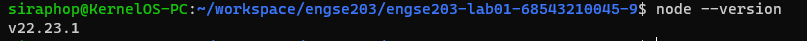
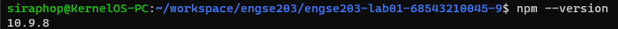
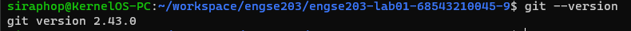
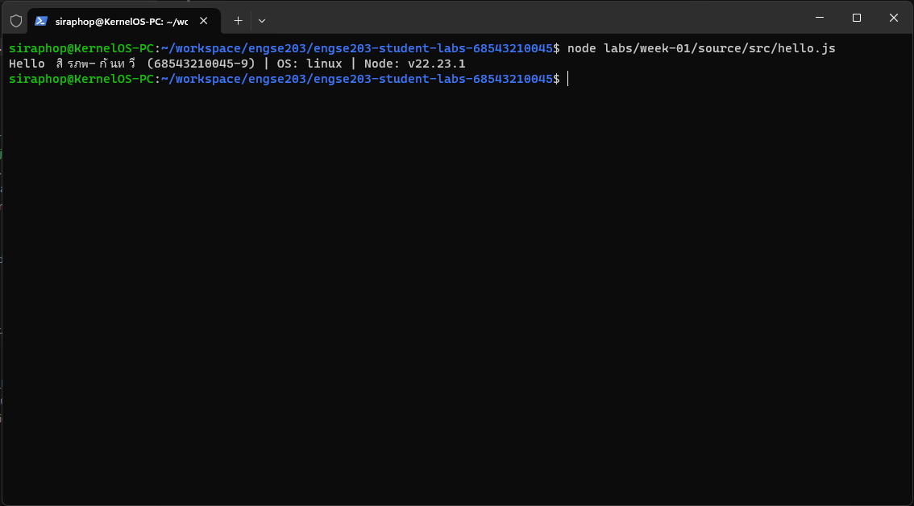

# Week 01 Evidence

ใส่ screenshots, test output หรือ reflection ที่ไม่ใช่ข้อมูลลับ แล้วอ้างชื่อไฟล์ใน `../README.md`

- ผล `node --version`, `npm --version`, `git --version`

- Screenshot โปรแกรม `hello.js`

- Original Repository URL และ Commit SHA
https://github.com/Uxsx/engse203-lab01-68543210045-9

- Reflection สั้น ๆ ว่าใช้ Git workflow อย่างไร
เริ่มต้นใช้งาน Git Workflow โดยการทำสอบการตั้งค่า Git บนเครื่อง, สร้าง Commit เพื่อบันทึกสถานะการทำโปรแกรม hello.js และใช้คำสั่งพื้นฐาน เช่น add, commit, push ในการทำงานร่วมกับ GitHub Repository ของแล็บ 1 

## Test Output
สามารถดูผลลัพธ์ได้จากไฟล์ [test-output.txt](./test-output.txt)