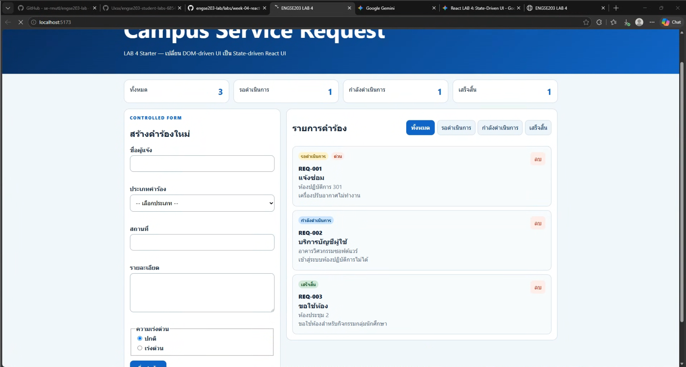
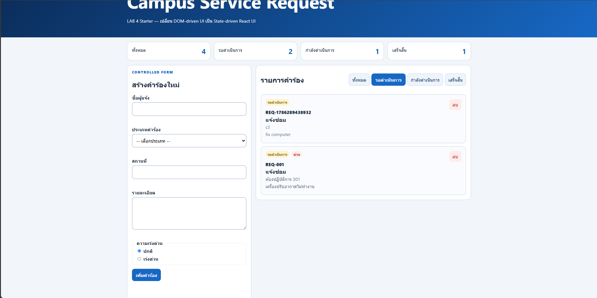
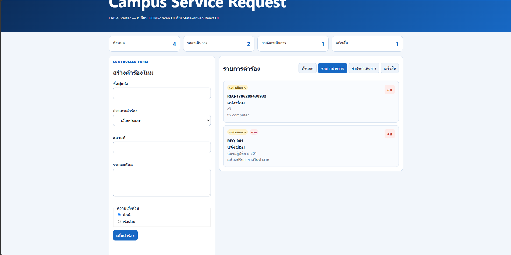
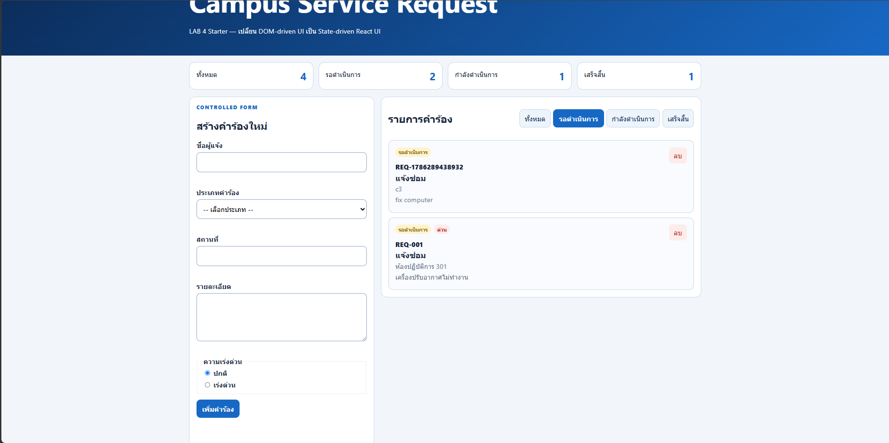
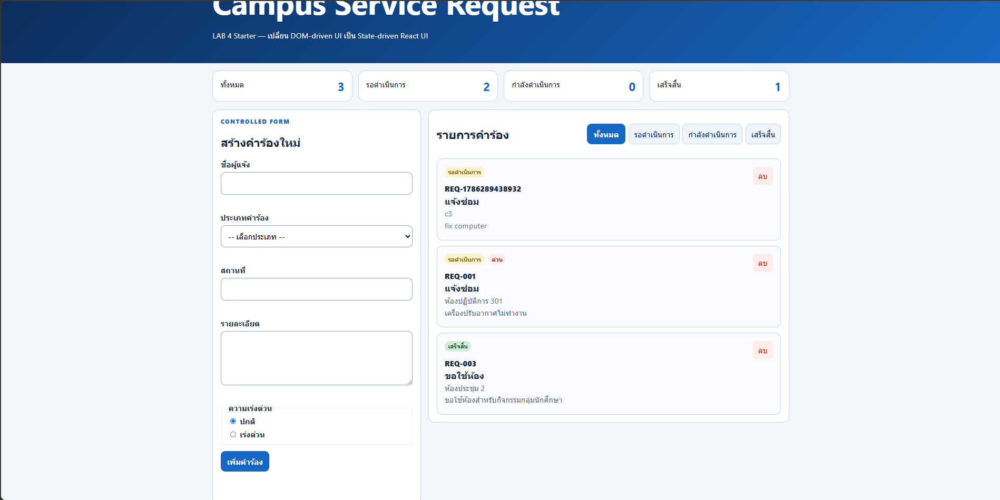
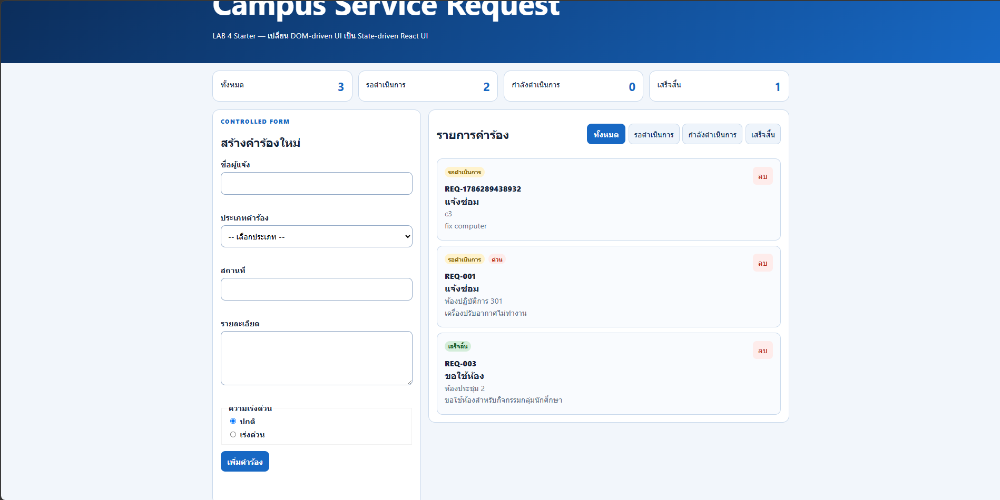
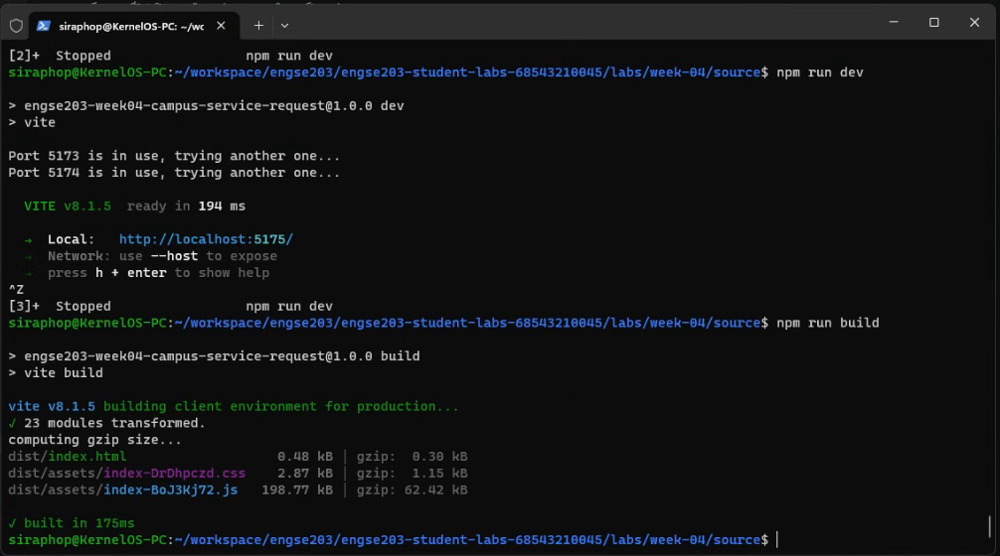

# LAB 4 Evidence

เก็บภาพที่ไม่เปิดเผยข้อมูลส่วนบุคคลเกินจำเป็น เช่น:

- `desktop.png`
- `mobile-375.png`
- `validation.png`
- `empty-state.png`
- `pages-incognito.png`

เชื่อมชื่อไฟล์เหล่านี้ใน README หลักของ repository นักศึกษา

| Test ID | Actual Result | Pass/Fail | Evidence/Screenshot |
|---|---|---|---|
| TC-01 Initial | แสดงรายการคำร้องเริ่มต้น 3 รายการ และ Summary ถูกต้อง | Pass |  |
| TC-02 Controlled input | พิมพ์ข้อความได้ตามปกติ ค่าในช่อง Input เปลี่ยนแปลงตามที่พิมพ์ | Pass |  |
| TC-03 Invalid | ขึ้นข้อความ Error สีแดงใต้ช่องที่ไม่ได้กรอก และกรอบเปลี่ยนเป็นสีแดง | Pass |  |
| TC-04 Valid add | มีการ์ดคำร้องใหม่เพิ่มขึ้นมาด้านบนสุด ฟอร์มถูกล้างข้อมูล และ Summary อัปเดต | Pass |  |
| TC-05 Filter | รายการคำร้องแสดงเฉพาะสถานะที่เลือกเท่านั้น | Pass |  |
| TC-06 All | รายการคำร้องกลับมาแสดงครบทุกรายการ | Pass |  |
| TC-07 Empty | แสดงข้อความ "ไม่พบรายการคำร้องที่ค้นหา" | Pass |  |
| TC-08 Delete | การ์ดที่กดลบหายไปจากหน้าจอทันที และตัวเลข Summary ลดลง | Pass |  |
| TC-09 Mobile | เลย์เอาต์เปลี่ยนจาก 2 คอลัมน์เป็น 1 คอลัมน์ หน้าจอไม่ล้น | Pass |  |
| TC-10 Keyboard | มีกรอบสีน้ำเงิน (Focus-visible) ปรากฏรอบปุ่มและฟอร์มที่กำลังกด Tab | Pass |  |
| TC-11 Build | พิมพ์คำสั่งรันผ่าน สร้างโฟลเดอร์ `dist` สำเร็จโดยไม่มีข้อความ Error | Pass |  |
| TC-12 Pages | อัปโหลดขึ้น GitHub Pages สำเร็จ หน้าเว็บเปิดติดและใช้งานได้ปกติ | Pass | `evidence/tc12.png` |
