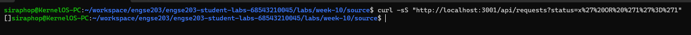
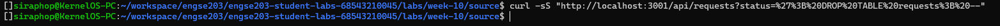
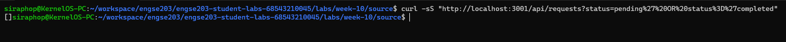
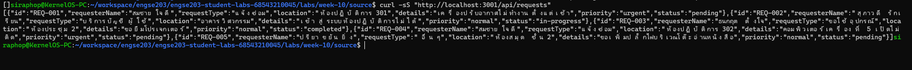

# SECURITY TEST — SQL Injection Protection

### ① ทดสอบเงื่อนไขที่เป็นจริงเสมอ

**ยิง**

```bash
curl -sS "http://localhost:3001/api/requests?status=x%27%20OR%20%271%27%3D%271"
```

**ผลที่ได้**

```json
[]
```

**หลักฐาน**

---

### ② ทดสอบการพยายาม DROP TABLE

**ยิง**

```bash
curl -sS "http://localhost:3001/api/requests?status=%27%3B%20DROP%20TABLE%20requests%3B%20--"
```

**ผลที่ได้**

```json
[]
```

**หลักฐาน**

---

### ③ ทดสอบการ bypass เงื่อนไข

**ยิง**

```bash
curl -sS "http://localhost:3001/api/requests?status=pending%27%20OR%20status%3D%27completed"
```

**ผลที่ได้**

```json
[]
```

**หลักฐาน**

---

### ④ พิสูจน์ว่าตารางยังอยู่และ API ยังทำงาน

**ยิง**

```bash
curl -sS "http://localhost:3001/api/requests"
```

**ผลที่ได้**

```json
[
  {
    "id": "REQ-001",
    "requesterName": "สมชาย ใจดี",
    "requestType": "แจ้งซ่อม",
    "location": "ห้องปฏิบัติการ 301",
    "details": "เครื่องปรับอากาศไม่ทำงานตั้งแต่เช้า",
    "priority": "urgent",
    "status": "pending"
  },
  {
    "id": "REQ-002",
    "requesterName": "ปรียา ขวัญดี",
    "requestType": "บริการบัญชีผู้ใช้",
    "location": "ตึกวิศวกรรม",
    "details": "ลืมรหัสผ่านและต้องการรีเซ็ตรหัส",
    "priority": "normal",
    "status": "in-progress"
  }
]
```

**หลักฐาน**


**อธิบาย**
API ยังตอบกลับข้อมูลจริงจากฐานข้อมูลได้ตามปกติ ซึ่งแสดงว่า SQL injection ไม่สามารถแทรกเข้าไปและเปลี่ยนความหมายของ query ได้

